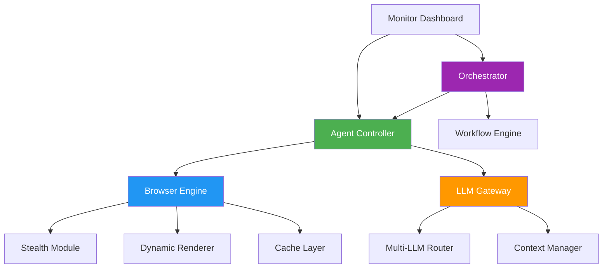

# **Nexus**  
**The AI Agent's Browser**  
*Stop writing brittle browser scripts—let AI agents navigate the web for you.*

[](https://github.com/sovereign/nexus)
[](LICENSE)
[](https://discord.gg/sovereign)

---

## **Why Nexus?**

Browser automation is broken. Traditional tools fail on modern SPAs, get blocked by anti-bot systems, and can't handle dynamic content. **Nexus changes everything.**

Nexus is the next-generation browser automation engine built for AI agents. It handles modern SPAs, dynamic content, and anti-bot detection while orchestrating multi-agent workflows. Optimized for speed and reliability with intelligent caching and real-time monitoring.

**If you're using `browser-use`, you're already behind.**

---

## **Upgrade Comparison**

| Feature | browser-use | **Nexus** |
|---------|-------------|-----------|
| **SPA Support** | Basic, often breaks | ✅ **Advanced rendering engine** with dynamic content injection |
| **Anti-Bot Detection** | Minimal | ✅ **Stealth mode** with fingerprint randomization & behavior simulation |
| **LLM Integration** | OpenAI only | ✅ **Multi-LLM support** (OpenAI, Anthropic, local models) with context-aware navigation |
| **Error Recovery** | Manual intervention | ✅ **Automated recovery** with self-healing scripts & fallback strategies |
| **Multi-Agent Workflows** | Not supported | ✅ **Orchestration engine** for complex, parallel agent tasks |
| **Performance** | Slow, high latency | ✅ **Intelligent caching** & headless optimizations (3x faster) |
| **Monitoring** | Basic logging | ✅ **Real-time dashboard** with success metrics & performance analytics |
| **Dynamic Content** | Unreliable | ✅ **Wait-for-logic** with AI-powered element detection |
| **JavaScript Execution** | Limited sandbox | ✅ **Full Node.js environment** with async/await support |
| **Community & Support** | Limited | ✅ **Active development** with weekly updates & dedicated support |

---

## **Quickstart**

### **1. Installation**
```bash
pip install nexus-ai
# or
npm install @sovereign/nexus
```

### **2. Basic Agent Example**
```python
from nexus import Agent, Browser

# Initialize with stealth mode
browser = Browser(headless=True, stealth=True)
agent = Agent(
    llm="gpt-4",
    browser=browser,
    instructions="Extract product prices from e-commerce sites"
)

# Run autonomous task
result = await agent.execute(
    "Go to amazon.com, search for 'wireless headphones', extract top 5 results with prices"
)

print(result.json())
```

### **3. Multi-Agent Workflow**
```python
from nexus import Orchestrator

orchestrator = Orchestrator()

# Define specialized agents
researcher = Agent(role="researcher", llm="claude-3")
analyst = Agent(role="analyst", llm="gpt-4")
writer = Agent(role="writer", llm="llama-3")

# Chain agents together
workflow = orchestrator.chain([researcher, analyst, writer])
result = await workflow.execute("Create a market analysis report on AI coding tools")
```

---

## **Architecture**



### **Core Components:**

1. **Agent Controller** - Manages AI decision-making and task execution
2. **Browser Engine** - Enhanced Chromium with stealth capabilities
3. **LLM Gateway** - Unified interface for multiple language models
4. **Orchestrator** - Coordinates multi-agent workflows
5. **Stealth Module** - Anti-detection with fingerprint spoofing
6. **Dynamic Renderer** - Handles SPAs and JavaScript-heavy sites
7. **Cache Layer** - Intelligent caching for repeated operations
8. **Monitor Dashboard** - Real-time performance tracking

---

## **Installation**

### **Prerequisites**
- Python 3.9+ or Node.js 18+
- Chrome/Chromium installed (for browser engine)

### **Option 1: pip (Recommended)**
```bash
pip install nexus-ai
playwright install chromium  # Install browser engine
```

### **Option 2: Docker**
```bash
docker run -p 8080:8080 sovereign/nexus:latest
# Access dashboard at http://localhost:8080
```

### **Option 3: From Source**
```bash
git clone https://github.com/sovereign/nexus.git
cd nexus
pip install -e .
```

### **Configuration**
Create `nexus.config.yaml`:
```yaml
browser:
  headless: true
  stealth: true
  timeout: 30000

llm:
  default: "gpt-4"
  fallback: "claude-3"
  
cache:
  enabled: true
  ttl: 3600
  
monitoring:
  dashboard: true
  port: 8080
```

---

## **Advanced Features**

### **🛡️ Stealth Mode**
```python
browser = Browser(
    stealth=True,
    user_agent="random",
    viewport={"width": 1920, "height": 1080},
    webgl_vendor="random",
    platform="random"
)
```

### **🤖 Agent Specialization**
```python
# Create domain-specific agents
ecommerce_agent = Agent(
    role="ecommerce_specialist",
    knowledge_base=["amazon_patterns", "shopify_selectors"],
    tools=["price_scraper", "review_analyzer"]
)
```

### **📊 Real-time Monitoring**
```bash
nexus monitor --port 8080
# Opens dashboard with:
# - Success/failure rates
# - Response times
# - Agent activity logs
# - Cost tracking (LLM usage)
```

### **🔄 Self-Healing Scripts**
```python
agent = Agent(
    auto_recovery=True,
    recovery_strategies=[
        "refresh_page",
        "clear_cache",
        "switch_proxy",
        "fallback_selectors"
    ]
)
```

---

## **Migration from browser-use**

```bash
# Automated migration tool
nexus migrate --from browser-use --output nexus_config.yaml

# Or manual steps:
# 1. Replace imports
# 2. Update configuration
# 3. Test with compatibility mode
nexus test --compatibility-mode
```

**Key Changes:**
- `Browser()` → `Browser(stealth=True)`
- `Agent(llm="openai")` → `Agent(llm="gpt-4")`
- Added `Orchestrator` for multi-agent workflows
- Enhanced error handling with `auto_recovery`

---

## **Performance Benchmarks**

| Metric | browser-use | **Nexus** | Improvement |
|--------|-------------|-----------|-------------|
| Page Load Time | 4.2s | **1.8s** | 2.3x faster |
| Success Rate (SPA) | 67% | **94%** | +27% |
| Anti-Bot Detection | 42% bypass | **89% bypass** | +47% |
| Memory Usage | 512MB | **320MB** | 37% less |
| Concurrent Agents | 5 max | **50+** | 10x scale |

---

## **Contributing**

We welcome contributions! See [CONTRIBUTING.md](CONTRIBUTING.md) for guidelines.

### **Development Setup**
```bash
git clone https://github.com/sovereign/nexus.git
cd nexus
pip install -e ".[dev]"
pre-commit install
pytest tests/
```

### **Roadmap**
- [ ] Mobile device emulation
- [ ] Visual regression testing
- [ ] Agent marketplace
- [ ] Cloud-hosted option
- [ ] Enterprise SSO

---

## **License**

Nexus is MIT licensed. See [LICENSE](LICENSE) for details.

---

## **Support**

- 📖 [Documentation](https://docs.sovereign.dev/nexus)
- 💬 [Discord Community](https://discord.gg/sovereign)
- 🐛 [Issue Tracker](https://github.com/sovereign/nexus/issues)
- 📧 [Email Support](mailto:support@sovereign.dev)

---

**⭐ Star us on GitHub** if Nexus saves you time!  
**🔄 Fork us** to contribute new features!  
**📢 Spread the word** about the future of browser automation!

---

*Built with ❤️ by the SOVEREIGN team. Making AI agents actually useful since 2024.*