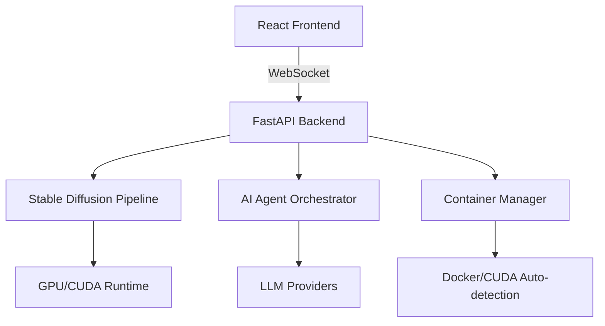

# **NEXUS**  
*The developer-first AI art platform that builds itself around your workflow.*  
[](https://opensource.org/licenses/MIT)  
[](https://github.com/your-org/nexus)  
[](https://discord.gg/your-invite)  

---

## **Where creation flows.**

Nexus is a **modern, React-based UI for Stable Diffusion** that replaces the clunky Gradio interface with a real-time collaborative workspace, built-in AI agent integration, and containerized dependency management. It’s the stable-diffusion-webui you know—reimagined for teams, automation, and seamless iteration.

---

## **Why Switch from stable-diffusion-webui?**

| Feature | stable-diffusion-webui | **Nexus** |
|---------|------------------------|-----------|
| **UI/UX** | Gradio-based, single-user, limited mobile support | **React-based, real-time collaboration, mobile-responsive, workflow builder** |
| **AI Integration** | Manual prompting, no agent support | **Native AI agents: LLM-driven prompt engineering, auto model selection, multi-step workflows** |
| **Dependency Management** | Manual CUDA setup, “works on my machine” issues | **Containerized with Docker, automatic CUDA/driver detection, one-click updates** |
| **Extensibility** | Python scripts, limited API | **Modular plugin system, REST API, WebSocket for real-time control** |
| **Performance** | Single-process, UI blocks during generation | **Async pipeline, non-blocking UI, progress streaming** |

---

## **Quickstart**

```bash
# Clone and start with Docker (auto-detects CUDA)
git clone https://github.com/your-org/nexus.git
cd nexus
./start.sh  # Installs, detects GPU, and launches in browser
```

Or run without Docker (requires Python 3.10+ and Node.js 18+):
```bash
pip install -r requirements.txt
npm run build
python launch.py --share
```

Open `http://localhost:7860` and start creating.

---

## **Architecture Overview**



- **Frontend**: React + TypeScript with real-time collaboration (CRDT-based)
- **Backend**: FastAPI serving async inference, WebSocket for live updates
- **AI Agents**: LangChain-based agents for prompt refinement, model routing, and workflow automation
- **Containerization**: Docker with NVIDIA runtime, automatic CUDA version matching
- **Storage**: SQLite for metadata, filesystem for models/outputs, optional S3 sync

---

## **Installation**

### Prerequisites
- Docker 20.10+ (recommended) **OR** Python 3.10+, Node.js 18+
- NVIDIA GPU with CUDA 11.7+ (AMD/Intel support via DirectML in beta)

### Option 1: Docker (Recommended)
```bash
# Auto-detects GPU and installs correct CUDA image
curl -fsSL https://get.nexus.dev | bash
nexus start
```

### Option 2: Manual Install
```bash
git clone https://github.com/your-org/nexus.git
cd nexus
python -m venv venv
source venv/bin/activate
pip install -r requirements.txt
python launch.py --listen --port 7860
```

### Option 3: One-Click Cloud Deploy
[](https://app.runwayml.com/clone/nexus)  
[](https://colab.research.google.com/github/your-org/nexus/blob/main/colab/nexus.ipynb)

---

## **Key Features**

### 🚀 **Modern UI & Real-Time Collaboration**
- Multi-user sessions with live cursors and shared galleries
- Drag-and-drop workflow builder for complex pipelines
- Mobile-responsive design for generation on the go

### 🤖 **AI Agent Integration**
```python
# Example: Use an LLM to refine prompts automatically
from nexus.agents import PromptEngineer
agent = PromptEngineer(model="gpt-4")
enhanced_prompt = agent.refine("a cat sitting on a rainbow")
```
- Automatic model selection based on style keywords
- Multi-step workflows: “Upscale → Face Fix → Color Grade”

### 📦 **Containerized & Hassle-Free**
- Automatic CUDA detection (supports 11.7, 12.1, 12.4)
- One-click updates: `nexus update --safe`
- Portable across Windows/Linux/macOS (macOS via CPU/Metal)

### ⚡ **Performance Optimized**
- Async inference queue (non-blocking UI)
- Model caching and smart VRAM management
- Support for SDXL, SD 1.5, LoRA, ControlNet out of the box

---

## **Migration from stable-diffusion-webui**

1. **Models & Outputs**: Nexus auto-imports from existing `stable-diffusion-webui/models` and `outputs` folders.
2. **Extensions**: Compatible with most SD webui extensions via adapter layer.
3. **Settings**: Run `nexus migrate --from=automatic1111` to copy configurations.

---

## **Roadmap**
- [ ] Real-time video generation (AnimateDiff + streaming)
- [ ] Team permissions and asset management
- [ ] Built-in model training (LoRA/Dreambooth) with UI
- [ ] API gateway for SaaS integration

---

## **Contributing**
We welcome PRs! See [CONTRIBUTING.md](CONTRIBUTING.md) for guidelines.

```bash
# Development setup
git clone https://github.com/your-org/nexus.git
cd nexus
./start.sh --dev  # Runs with hot-reload
```

---

## **Community & Support**
- [Discord](https://discord.gg/your-invite) - 24/7 community help
- [GitHub Discussions](https://github.com/your-org/nexus/discussions) - Feature requests
- [Twitter](https://twitter.com/nexus_dev) - Updates and tips

---

## **License**
Nexus is [MIT licensed](LICENSE).  
*Stable Diffusion models are subject to their respective licenses.*

---

**Star the repo** if you believe AI art tools should be developer-first.  
⭐ **[GitHub](https://github.com/your-org/nexus)** | 🚀 **[Quickstart](#quickstart)** | 🤖 **[Agent Docs](https://docs.nexus.dev/agents)**

---

*Built with ❤️ by engineers who were tired of fighting Gradio.*